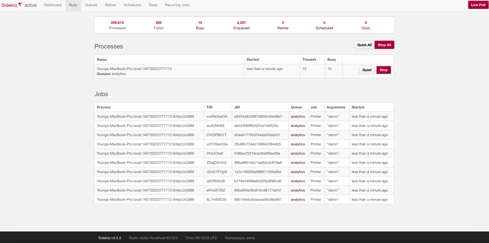
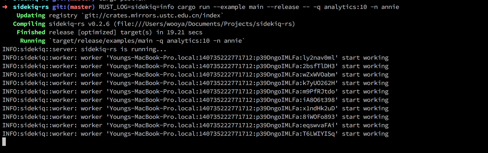

Sidekiq-rs    
====

Sidekiq compatible server in rust, which behaviours totally
same as vanilla when you take a look into 
sidekiq's dashboard.

The basic idea is that, since ruby is slow, we write job handlers
in rust with native code. So we write job definitions in ruby and implementations in rust
and enqueue jobs in ruby and done jobs in rust.

## Snapshots:

## Usage:

1. Implementing your own `JobHandler` and `JobHandlerFactory`
2. Instantiate a sidekiq-rs server and insert your own job handlers
3. Set up dummy jobs with same name as your job handlers in ruby
4. Run sidekiq-rs server and submit jobs from ruby

You can refer to `examples/main.rs` 
for building a sidekiq-rs server, and refer to codes in `ruby`
to get an idea on write dummy tasks in ruby.

## Advanced usage:

You can definitely embed a ruby VM in your job handlers,
running ruby codes when the job is not a native job, 
so that it soon becomes a complete sidekiq server with additional
native code support.

## Terminate the sidekiq-rs:

sidekiq-rs includes an implementation of signal handling,
and it currently recognize 2 type of signals:

* SIGINT, fpr force exiting the server. The server will 
terminate all workers and exit in exactly certain time. The 
default time is 10 seconds.
* SIGUSR1, for gracefully exiting the server. The server will
inform and wait workers to quit.

Server will not accept anymore jobs if either signal received.

## TODO:

- [x] Sidekiq dashboard capability.
- [x] Exit signal handling.
- [x] Support arbitrary fields in job object.
- [ ] Middleware support.
- [ ] Job retry support.
- [ ] Scheduled job support.